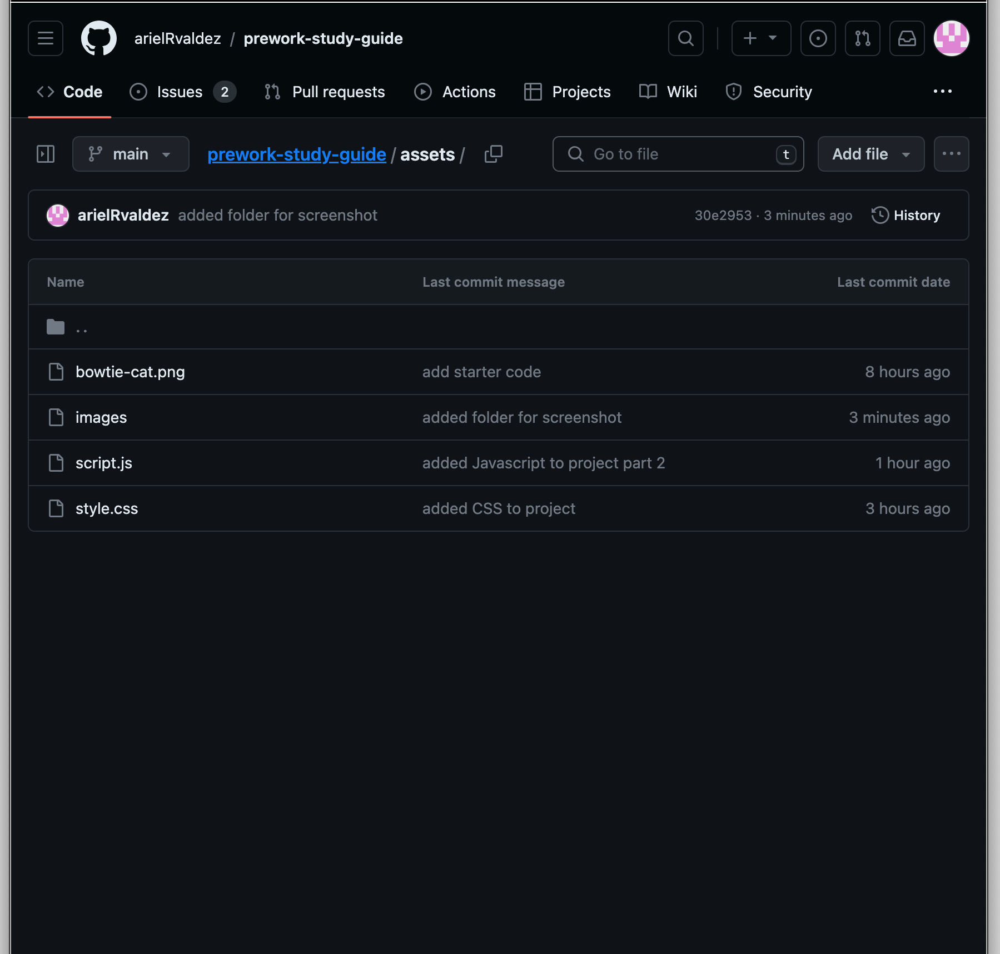

# Prework Study Guide Webpage

## Description

I created this study guide for referencing during lessons so I used my own vocabulary as much as possible. By using my "own words" allowed me to understand the concepts better. I learned the basics of HTML, CSS, Git, and JavaScript.

## Installation

I needed to download and install Github and Vs Code which are both free. Terminal was already installed on my MacBook which saved a some time. 

## Usage

## Credits

https://developer.mozilla.org/en-US/docs/Learn/Getting_started_with_the_web/JavaScript_basics

## License

MIT License

Copyright (c) [2023] [Ariel Valdez]

Permission is hereby granted, free of charge, to any person obtaining a copy
of this software and associated documentation files (the "Software"), to deal
in the Software without restriction, including without limitation the rights
to use, copy, modify, merge, publish, distribute, sublicense, and/or sell
copies of the Software, and to permit persons to whom the Software is
furnished to do so, subject to the following conditions:

The above copyright notice and this permission notice shall be included in all
copies or substantial portions of the Software.

THE SOFTWARE IS PROVIDED "AS IS", WITHOUT WARRANTY OF ANY KIND, EXPRESS OR
IMPLIED, INCLUDING BUT NOT LIMITED TO THE WARRANTIES OF MERCHANTABILITY,
FITNESS FOR A PARTICULAR PURPOSE AND NONINFRINGEMENT. IN NO EVENT SHALL THE
AUTHORS OR COPYRIGHT HOLDERS BE LIABLE FOR ANY CLAIM, DAMAGES OR OTHER
LIABILITY, WHETHER IN AN ACTION OF CONTRACT, TORT OR OTHERWISE, ARISING FROM,
OUT OF OR IN CONNECTION WITH THE SOFTWARE OR THE USE OR OTHER DEALINGS IN THE
SOFTWARE.

---

## Badges

https://github.com/arielRvaldez?achievement=pull-shark&tab=achievements

## How to Contribute

https://img.shields.io/badge/Contributor%20Covenant-2.1-4baaaa.svg

Thank you for reading.
